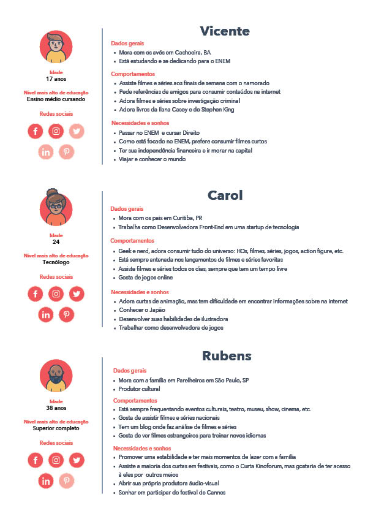
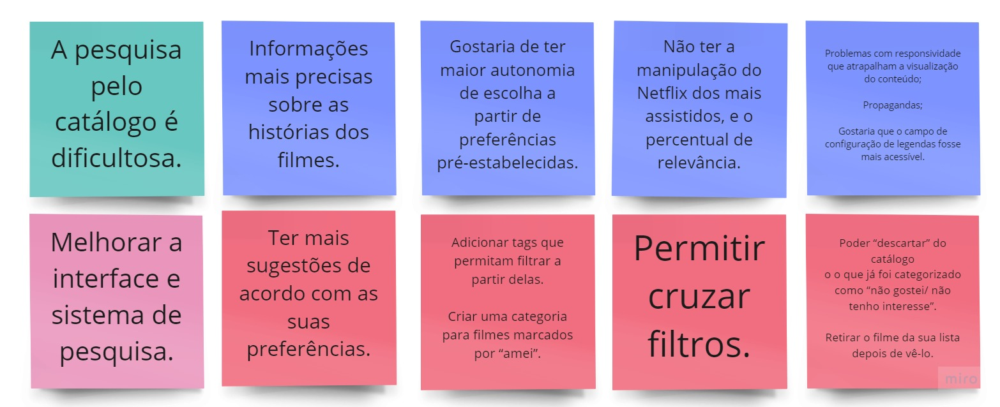

---

Uma aplicação Web para te ajudar a achar os melhores curtas. Para acessar clique aqui! :clapper: 🎬 

## Índice
- [1. Desafio](#1-desafio)
- [2. Introdução](#2-introdução)
- [3. Processo](#3.processo)
- [4. Produto](#4.produto)
- [5. Ferramentas](#5.ferramentas)
- [6. Créditos](#6.créditos)
- [7. Autoras](#7.autoras)

---

## 1. Desafio
Esse projeto foi desenvolvido em grupo durante o Midterm Hackathon do bootcamp da Laboratoria que trouxe como proposta desenvolver um produto relacionado à entreterimento, utilizando a metodologia de Design Sprint durante uma semana e implementando-o em dois dias, sendo um requisito obrigatório o consumo de API.

## 2. Introdução
Em tempos pandêmicos, as plataformas de streaming invadiram de vez as nossas casas. Se antes a possibilidade de assistir filmes de onde estiver, quando, como e com quem quiser já era atrativa, com o isolamento social essas plataformas se tornaram a principal fonte de entretenimento para milhares de pessoas em nível global. Somente em março de 2020, quando foi declarada uma pandemia mundial, houve um crescimento de 20% dos serviços de streaming, segundo a pesquisa da [Conviva](https://www.forbes.com.br/principal/2020/08/streaming-ganha-ainda-mais-relevancia-com-o-isolamento-social/).

No entanto, diversos serviços com catálogos que parecem não ter fim e interfaces não intuitivas, acabam gerando uma difícil jornada para o usuário encontrar títulos de seu interesse. Isso se agrava quando procuramos por conteúdos de áudio-visual menos populares, como os curta-metragens. Diante disso, desenvolvemos a aplicação Curta Curtas a partir da metodologia [Desing Sprint](https://www.youtube.com/watch?v=aWQUSiOZ0x8&feature=emb_title).  

## 3. Processo
:mag_right: **Descobrimento e investigação**
&nbsp;

No primeiro momento, fizemos um brainstorm de ideias, em um [mural](https://miro.com/app/board/o9J_lXU9JBU=/) virtual, focando em possíveis recortes de tema e partindo das nossas dores como pessoas que buscam entretenimento na Web. Em grupo decidimos que iríamos focar nos usuários de plataformas de streaming, fizemos buscas em diferentes locais, como o site Reclame Aqui e nas avaliações feitas em lojas de aplicativos, assim criamos as protopersonas para direcionarmos o nosso processo de investigação e mapearmos o problema a ser solucionado com nosso produto. Finalizamos essa etapa com a elaboração de um formulário para validar as nossas protopersonas e entender melhor quais são as necessidades e os comportamentos dos nossos usuários.

 

:memo: **Síntese e definição**
&nbsp;

Com o resultado do formulário em mãos conseguimos validar as protopersonas e identificar que os nossos usuários principais são mulheres e homens, com faixa etária entre 26 e 33 anos, estudantes e residentes em São Paulo e região. São clientes das plataformas de streaming Netflix, Prime Video e Spotify e acessam esses serviços pelo smartphone. Além disso, mapeamos as dificuldades encontradas ao navegar nessas aplicações e quais melhorias gostariam que esses sites oferecessem. 

Em síntese, essas usuárias têm experiências ruins nestas plataformas, o que dificulta muito a busca por conteúdos que sejam do seu real interesse. Diante disso, usamos a técnica de Design Thinking How Might We (HMW), ou Como Poderíamos, para nos ajudar a entender melhor os problemas e levantar possíveis soluções para o mesmo:

*Como poderíamos redesenhar a jornada de pesquisa por títulos em catálogos de streaming para torná-la mais personalizada para cada usuário?*

:pushpin: Criar mais filtros para busca de títulos e permitir que eles se cruzem.

&nbsp;
:pushpin: Indicar em quais streamings o usuário pode encontrar aquele título.

&nbsp;
:pushpin: Criar coleções de títulos customizadas por cada usuário.

&nbsp;
:pushpin: Criar um sistema de avaliação de filmes personalizada pelo próprio usuário.

&nbsp;

:bulb: **Ideação**
&nbsp;

Com as funcionalidades necessárias levantadas para o MPV, partimos para fazer um novo benchmark, dessa vez com um foco mais preciso para as soluções levantadas para o problema dos nossos usuários. Entretanto, descobrimos nessa etapa da pesquisa que havia um produto que atendia a todas as soluções propostas de maneira eficiente. 

Como grupo, decidimos voltar alguns passos e redirecionar, portanto, a nossa solução para um grupo de usuários mais específicos dentro do que já havíamos levantado. Desse modo, focamos nos usuários que assistem curta-metragens que, além de compartilharem das mesmas dores dos nossos usuários iniciais, também têm dificuldade em encontrar esses títulos nas plataformas de streaming de vídeo mais populares.

:date: **Planejamento**
&nbsp;

Com a definição do Mínimo Produto Viável (MPV), desenvolvemos as histórias de usuários, estabelecendo os critérios de aceitação e a definição de pronto. A partir delas, fizemos o [planejamento](https://trello.com/b/7wlIHXY5/midterm-hackton) para a implementação do produto utilizando o modelo de Kanban. Para o desenvolvimento do código trabalhamos com o code review.

## 4. Produto
:bulb: **Identidade visual**

A paleta de cores foi inspirada no cartaz da primeira exibição de um filme, um curta chamado [L’arrivée d’un Train à La Ciotat](https://pt.wikipedia.org/wiki/Ficheiro:Cinematograph_Lumiere_advertisement_1895.jpg) (A chegada do trem em La Ciotat) lançado em 1895 no Salão Grand Café, em Paris. 

:bulb: **Logo**
&nbsp;

Criamos o logo a partir da imagem de uma câmera de filme antiga, e para o nome da nossa aplicação utilizamos a fonte Metropolis 1920 (Picmonkey) para criar uma referência de nostalgia e de saudosismo ao início das exibições dos filmes.

A proposta é remeter ao usuário a grandiosidade que é o universo cinematográfico, e proporcionar a experiencia de oferecer uma vasta lista curtas dos mais diversos gêneros, países, transformando a experiência com este tipo de mídia.

:bulb: **Funcionalidades**
&nbsp;

Com o redirecionamento do problema e da solução do produto, as funcionalidades implementadas no MPV foram:

:pushpin: Catalogar títulos de curta-metragens consumindo uma API.
&nbsp;

:pushpin: Permitir que o usuário busque o título pelo nome em uma barra de pesquisa.
&nbsp;

:pushpin: Criar filtros (gênero, ano, diretor, nota do IMDB e duração) para busca de títulos e permitir que eles se cruzem.
&nbsp;

:pushpin: Ordenar o resultado da lista por ordem alfabética.
&nbsp;

:pushpin: Criar uma conta de usuário na aplicação com e-mail e senha ou com o Google.
&nbsp;

:pushpin: Permitir que o usuário crie coleções de títulos que ele curtiu ou descurtiu. 

:iphone: Para acessar nosso protótipo mobile clique [aqui](https://www.figma.com/file/6e75XnGe5FGT27XcxTkMPP/Curta-Curtas-WebApp?node-id=42%3A0).
:computer: E para acessar nosso protótipo desktop clique [aqui](https://www.figma.com/file/aOQYSDV26XXsg5IkdPzvKF/Curta-Curtas---Desktop?node-id=0%3A1).

:bulb: Canvas

:bulb: **Futuras implementações:**
&nbsp;

:pushpin: Expandir o catálogo de curtas.

&nbsp;
:pushpin: Indicar em qual streaming ou plataforma o usuário consegue assistir o curta.

&nbsp;
:pushpin: Criar um sistema de avaliações em nota feitas pelos usuários.

&nbsp;
:pushpin: Permitir que o usuário deixe comentários sobre os curtas.

&nbsp;
:pushpin: Permitir que o usuário adicione amigos.

## 5. Ferramentas
:wrench: Desenvolvimento Front-End 
* JavaScript(ES6+)
* HTML5
* CSS3
* Bootstrap
* Firebase

:wrench: Desenvolvimento do Produto
* Miro
* Trello
* Picmonkey
* Marvel
* Figma

## 6. Créditos
* [Laboratoria](https://www.laboratoria.la/) :yellow_heart:
* [Open Movies Database API](http://www.omdbapi.com/)

## 7. Desenvolvedoras
:princess: [Beatriz Penalva](https://github.com/beatrizpenalva);

&nbsp;
:princess: [Cris Mantovani](https://github.com/crismantovani);

&nbsp;
:princess: [Giovana Madeira](https://github.com/giomadeira);

&nbsp;
:princess: [Jessica Cavalcante](https://github.com/JessicaCavalcante);

&nbsp;
:princess: [Juliane Cristina](https://github.com/Juliane-C);

&nbsp;
:princess: [Nicaely Joane](https://github.com/Nijoane);

&nbsp;
:princess: [Talita Silva](https://github.com/Talita-8).